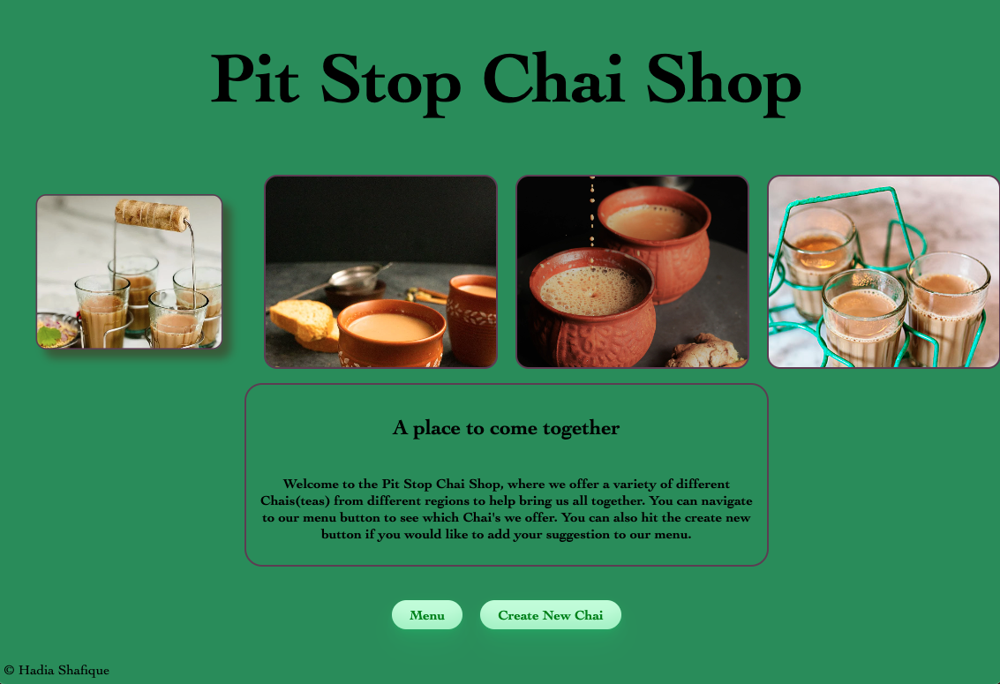
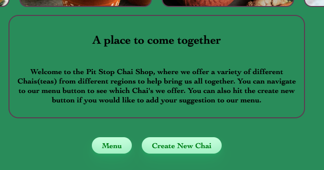

# PIT STOP CHAI SHOP 
### By: Hadia Shafique
## Motivation

My motivation for this store was to bring everyone together while they explore different tea's across the globe. I wanted to give the element of a 'pit stop' that allows you to explore, try new things and also gives you an experience. 

### Github link 
[Pit Stop Chai Shop](https://github.com/hadiashafique97/ChaiShop.git)

## Access

You can fork or clone the repo by copy and pasting the following in your terminal 

`git clone https://github.com/hadiashafique97/ChaiShop.git`

### THE STORE/ HOW TO 

The Store was a concept inspired by my family who are chai fanatics. Considering everyone loves a good cup of tea while they spill some tea, I wanted to create a pit stop that would highlight authentic chais across the world. The first page you land on is the Home route. It displays a variety of different chais and tells you about the site. There are two navigation buttons that allow you to go visit our Menu or Create New Chai. 

The paragraph right under neath the variety of different pictures welcomes you to the page and tells you more about the store.The Menu button takes you to the index route which shows the list of Chais that are featured at the Pit Stop Chai Shop. The Create New button directs you to our create New Route where the user can make a suggestion and get their Chai added to the Menu list.

Once you navigate to the Index page (Menu Page) you can then view the list of Chais featured in the Store.
