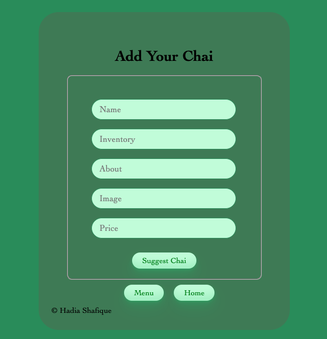
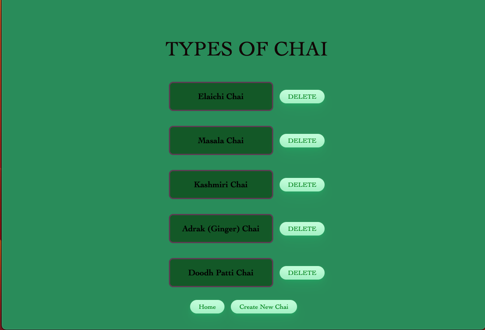
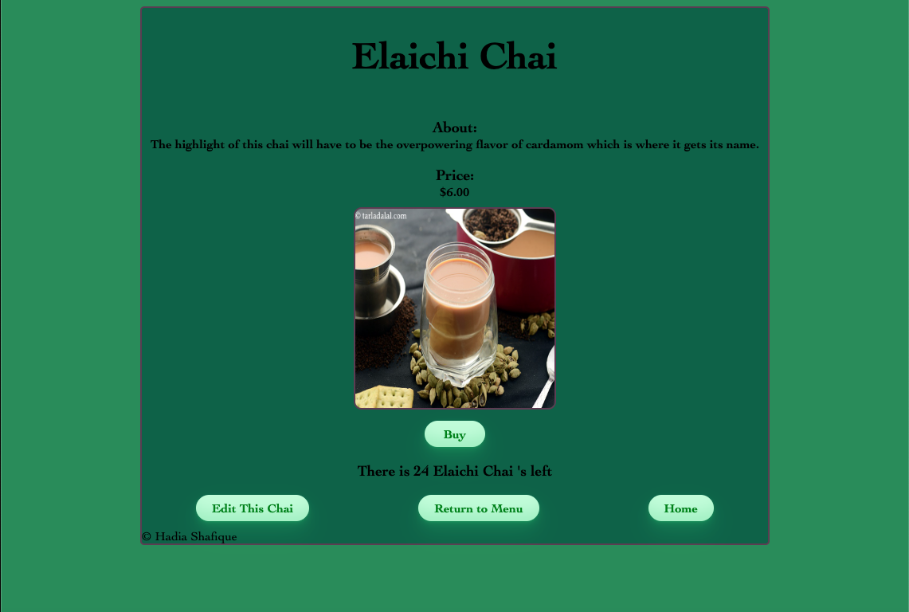
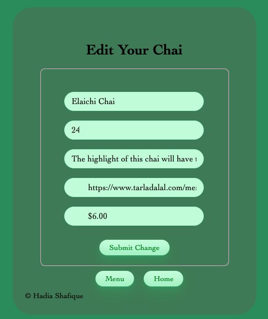

# PIT STOP CHAI SHOP 
### By: Hadia Shafique
## Motivation

My motivation for this store was to bring everyone together while they explore different tea's across the globe. I wanted to give the element of a 'pit stop' that allows you to explore, try new things and also gives you an experience. 

### Youtube link 
[Youtube](https://youtu.be/YWFz5vKhKbo)
### Github link 
[Pit Stop Chai Shop](https://github.com/hadiashafique97/ChaiShop.git)

## Access

You can fork or clone the repo by copy and pasting the following in your terminal 

`git clone https://github.com/hadiashafique97/ChaiShop.git`

### THE STORE/ HOW TO 

The Store was a concept inspired by my family who are chai fanatics. Considering everyone loves a good cup of tea while they spill some tea, I wanted to create a pit stop that would highlight authentic chais across the world. The first page you land on is the Home route. It displays a variety of different chais and tells you about the site. There are two navigation buttons that allow you to go visit our Menu or Create New Chai. 

The paragraph right under neath the variety of different pictures welcomes you to the page and tells you more about the store.The Menu button takes you to the index route which shows the list of Chais that are featured at the Pit Stop Chai Shop. The Create New button directs you to our create New Route where the user can make a suggestion and get their Chai added to the Menu list.

The Create New button takes you to a sample form that allows the user to add a Chai of their own liking to the menu and make a suggetion. The input fiels require the same information that is displayed on the Show page for Each item already on the menu.

Once you navigate to the Index page (Menu Page) you can then view the list of Chais featured in the Store. Right next to each featured Chai there is a Delete button where if the user does not like the Chai, they are able to Delete it from the Menu. On that page you also have a button for Create New Chai and Home again taking you back to the suggestion form or the home page of the Store. You can click each Chai in the list to then be navigated to the Show page. 

After you click on each chai you will be directed to the Show page. Which highlights each of the Menu items in detail with a speicifc picture of that Chai, a little fun fact, the price, and the in stock quantity, which when reached 0 will display Out Of Stock. You also have the Buy button which allows you to purchase that Chai, as you click the buy button the in stock amount will decrease by one, when reached zero as previously stated the Out of stock message will display and the buy button will dissapear. You also have the option to Edit Chai, Return to Menu, and Home button. 

The Edit Chai button allows user to edit the current item however it does have a default value of the existing item already populated in the form. The user can edit anything on the existing Menu item whether it be the Name, Picture, About, Price,  or Inventory. The Edit Page also features a Submit button which submits the changes and posts them to the database. It also features the Menu and Home button which lead you back to the menu page or the home page. 

## Technologies Used
- HTML
- CSS
- VSCode
- MongoDB
- Mongoose
- React
- Express
- Github

## Acknowledgements

These are all the resources I used to help me create my final Store. 

- [w3Schools](https://www.w3schools.com/default.asp)
- [MDN](https://developer.mozilla.org/en-US/)
- [Udemy](https://www.udemy.com/course/50-projects-50-days/)
- [Stack Overflow](https://stackoverflow.com/questions/4747520/simple-css-form-layout)
- [Free Front-End](https://freefrontend.com/css-forms/)
- [GetCssScan](https://getcssscan.com/css-buttons-examples)

